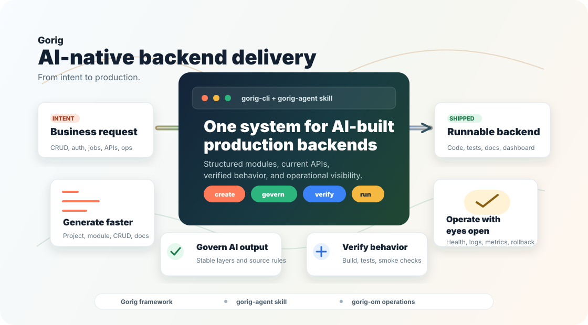

# Gorig: AI-Native Backend Delivery System [](https://deepwiki.com/WnJee/gorig)

[English](README.md) | [简体中文](README.zh-CN.md)

**Gorig** is a backend delivery system for the AI era. It combines a Go web service framework, `gorig_gen_cli`, and the `gorig-agent` AI skill so teams can turn product intent into structured, verified, and operable backend services.

📚 **Project Wiki**: [https://deepwiki.com/WnJee/gorig](https://deepwiki.com/WnJee/gorig)  
🔧 **Operations Dashboard**: [https://github.com/WnJee/gorig-om](https://github.com/WnJee/gorig-om)



## Why Gorig

AI can generate backend code quickly, but speed alone is not enough. Real teams still need stable architecture, source-aware framework usage, tests, documentation, runtime visibility, and a path from local development to production operation.

Gorig packages those needs into one delivery workflow:

| Product value | What teams get |
|---|---|
| Ship from intent | Describe a business need such as CRUD, login, reminders, live updates, async jobs, or deployment prep, then generate a runnable Go service shape. |
| Keep AI on rails | Preserve consistent Router -> Controller -> Service -> Model boundaries instead of accepting one-off generated code. |
| Verify before trust | Treat AI output as a delivery artifact with build checks, tests, smoke verification, and generated docs. |
| Operate after launch | Use built-in patterns for health, logs, scheduling, messaging, SSE, auth, configuration, graceful shutdown, and rollback planning. |
| Grow as an ecosystem | Pair with `gorig-agent` for autonomous delivery and `gorig-om` for runtime observability and operations. |

## Delivery Workflow

Gorig is designed around the full backend lifecycle, not a single scaffolding command.

| Step | What happens |
|---|---|
| 1. Describe | Start from product language: customer management, order workflow, reminder task, admin API, service deployment. |
| 2. Scaffold | Structure projects, modules, CRUD services, validation rules, docs, and environment configuration. |
| 3. Implement | The `gorig-agent` skill guides AI agents with real Gorig APIs, module boundaries, source checks, and framework rules. |
| 4. Verify | Generated services are expected to pass `go fmt`, `go vet`, `go build`, and route-level checks. |
| 5. Operate | Services connect to `gorig-om` for runtime monitoring, log analysis, error clustering, and lifecycle management. |

## Ecosystem

| Project | Role |
|---|---|
| `gorig` | Core Go backend framework: HTTP routing, generic request binding (`apix`), fluent ORM (`dx`), multi-level cache, distributed cron, auth, messaging, SSE, and storage. |
| `gorig_gen_cli` | Official scaffolding & code generation CLI tool: DDD-based project scaffolding, domain module creation, OpenAPI spec generation & ReDoc preview. |
| `gorig-agent` | AI Agent delivery skill: framework-aware implementation rules, layer boundaries, CLI scaffolding priority, and engineering guidelines. |
| `gorig-om` | Operations & Observability platform: service status, runtime metrics, logs, error signatures, goroutine trends, and memory diagnostics. |

## Quick Start

### Create a New Backend

Run without installing globally:

```sh
npx gorig_gen_cli@latest init my-new-project
```

Or install the CLI globally:

```sh
npm install -g gorig_gen_cli
gorig_gen_cli init my-new-project
```

The generated project includes a runnable entry point (`_cmd/main.go`), multi-environment configs (`_bin/*.yaml`), HTTP services (`api/init.go`), and DDD domain initialization (`domain/init.go`).

### Run the Project

```sh
cd my-new-project
go run _cmd/main.go
```

### Add a Business Module

```sh
npx gorig_gen_cli@latest create user
```

This creates the outer API layer and inner DDD domain layer, and auto-registers them in `api/init.go` and `domain/init.go`:

```text
├── api/user/
│   ├── controller.go     # HTTP Controller (apix.BindReq generic binding)
│   └── router.go         # Route group registration
└── domain/user/
    ├── dto.go            # Request, Response, and Filter DTOs
    ├── model.go          # Data entity model & AutoMigrate
    └── service.go        # Domain business logic (dx ORM operations)
```

### Generate and Preview API Documentation

```sh
npx gorig_gen_cli@latest doc
```

## Use with AI Agents

When you want AI agents (Claude Code, Codex, Cursor, Antigravity) to deliver backend applications following Gorig standards, load the official `gorig-agent` Skill.

### Install & Enable Skill

**Option 1: One-Click CLI Installation (Recommended, no repo clone needed)**
```sh
# Install to current project and all local AI Agent directories (Antigravity / Claude Code / Codex / Cursor):
npx gorig_gen_cli@latest skill

# Or install to specific Agent / Global directories:
npx gorig_gen_cli@latest skill install antigravity  # Install to Google Antigravity (~/.gemini/antigravity/skills/)
npx gorig_gen_cli@latest skill install claude       # Install to Claude Code (~/.claude/skills/)
npx gorig_gen_cli@latest skill install project      # Install to current project only (.agent/skills/ and .claude/skills/)
npx gorig_gen_cli@latest skill install global       # Install to all global Agent directories on the machine
```

> **Tip**: Projects created with `npx gorig_gen_cli@latest init <project-name>` already include `.agent/skills/gorig-agent/SKILL.md` and `AGENTS.md` by default.

### Core Agent Delivery Rules
1. **Scaffolding Priority**: When initializing a project or creating a new module, **prioritize directly executing `gorig_gen_cli` CLI commands** (`npx gorig_gen_cli@latest init <project>` / `npx gorig_gen_cli@latest create <module>`) to establish DDD boundaries and automatic registration.
2. **Layer Separation**: Preserve strict `Router -> Controller -> Service -> Model/DX` boundaries; controllers handle HTTP translation and validation, while services orchestrate business logic and transactions.
3. **No Persistent Test Files**: Verify with `go vet ./...` and `go build ./...`; do not leave temporary test files in the repository unless explicitly requested.

### Prompt Examples

Ask for backend work in product language:

```text
Use the gorig-agent skill and gorig_gen_cli to initialize the project and create an order module with creation, status lifecycle, and pagination.
```

```text
Use the gorig-agent skill to add tokenx-based JWT authentication, token refresh, and auth middleware to the user module.
```

```text
Use the gorig-agent skill to set up cronx distributed cron jobs for nightly data archiving at 03:00 AM.
```

## Functional Modules & Demos

Gorig provides clean, high-productivity modules for backend development. Explore practical guides and code demos for each package:

| Package | Key Capabilities | Guide & Demos |
|---|---|---|
| **`apix`** | Route/Query/Form/JSON param extraction, generic `BindReq[T]`, unified responses, custom validators, panic/error recovery | [📘 apix Guide & Demos](docs/demos/apix.md) |
| **`domainx / dx`** | Type-safe fluent ORM, multi-engine (MySQL, MongoDB, SQLite), auto Snowflake ID, transactions, pagination | [📘 domainx Guide & Demos](docs/demos/domainx.md) |
| **`cache`** | Multi-level cache (Memory, Redis, SQLite, JSON), `Remember` anti-stampede Singleflight, distributed locks | [📘 cache Guide & Demos](docs/demos/cache.md) |
| **`httpx` & `ssex`** | Gin engine management, security middlewares, generic HTTP client (`GetJSON`, `Post`), SSE streaming with heartbeat | [📘 httpx Guide & Demos](docs/demos/httpx.md) |
| **`cronx`** | Standard Cron, interval tasks, delay tasks, Redis-backed persistent distributed tasks with auto-recovery | [📘 cronx Guide & Demos](docs/demos/cronx.md) |
| **`mid/tokenx`** | JWT issuance & parsing, claims extraction, token revocation/blacklist, Memory/Redis storage | [📘 tokenx Guide & Demos](docs/demos/tokenx.md) |
| **`mid/messagex`** | Event bus, local & Redis Pub/Sub, typed event pub/sub (`PublishEvent`, `SubscribeEvent`), DLQ replay | [📘 messagex Guide & Demos](docs/demos/messagex.md) |
| **`storage`** | Unified object storage (Local, S3, OSS, MinIO), string/byte/file helpers, resumable upload, presigned URLs | [📘 storage Guide & Demos](docs/demos/storage.md) |
| **`utils`** | Structured logging, YAML/env configuration, AES/Bcrypt encryption, error models, alert notifications (DingTalk/Feishu/WeCom) | [📘 utils Guide & Demos](docs/demos/utils.md) |

## Framework Installation

If you only need the Go framework dependency:

```sh
go get github.com/WnJee/gorig@latest
```

For most new projects, start with `gorig_gen_cli` instead of adding the package manually.

## Quality Gates

Recommended checks before shipping:

```sh
go fmt ./...
go vet ./...
go build ./...
go test ./... -v
```

For generated persistent CRUD modules, run the default tests first, then run database integration tests after local MySQL or MongoDB configuration is ready.
