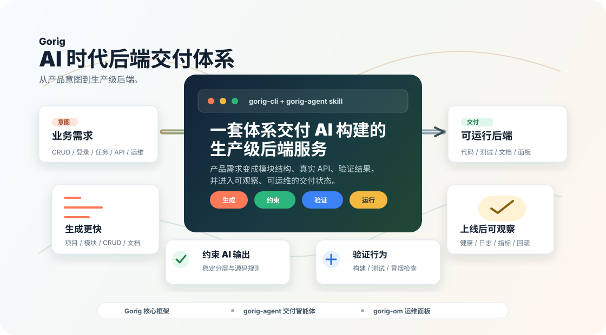

# Gorig：AI 时代后端交付体系 [](https://deepwiki.com/WnJee/gorig)

[English](README.md) | [简体中文](README.zh-CN.md)

**Gorig** 是面向 AI 时代的后端交付体系。它把 Go Web 服务框架、`gorig_gen_cli` 和 `gorig-agent` AI Skill 组合在一起，让团队可以把产品意图转化为结构稳定、可验证、可运维的后端服务。

🔧 **运维面板**：[https://github.com/WnJee/gorig-om](https://github.com/WnJee/gorig-om)



## 为什么是 Gorig

AI 可以很快生成后端代码，但真实团队需要的不只是“快”。团队还需要稳定的架构边界、基于真实框架源码的 API 使用、测试、文档、运行可观测性，以及从本地开发走向生产运维的路径。

Gorig 把这些能力打包成一套可重复的后端交付流程：

| 产品价值 | 团队获得什么 |
|---|---|
| 从意图到交付 | 用业务语言描述 CRUD、登录、提醒、实时更新、异步任务或部署准备，然后生成可运行的 Go 服务结构。 |
| 让 AI 有边界 | 固化 Router -> Controller -> Service -> Model 分层，避免 AI 产出一次性的、不稳定的代码形态。 |
| 先验证再信任 | 把 AI 输出当成交付物处理：构建检查、测试、冒烟验证和文档要和代码一起产生。 |
| 上线后可运维 | 内置健康检查、日志、定时任务、消息、SSE、认证、配置、优雅退出和回滚规划等后端常见能力。 |
| 生态化扩展 | 结合 `gorig-agent` 开展智能化交付，并在服务上线后接入 `gorig-om` 获得全方位运行可观测性与运维管控。 |

## 交付流程

Gorig 关注完整后端生命周期，而不是单个脚手架命令。

| 阶段 | 发生什么 |
|---|---|
| 1. 描述需求 | 从产品语言开始：客户管理、订单流程、提醒任务、管理后台 API、服务部署。 |
| 2. 生成结构 | 规划项目、模块、CRUD 服务、校验规则、文档和环境配置。 |
| 3. 实现功能 | `gorig-agent` Skill 用真实 Gorig API、模块边界、源码检查和框架规则约束 AI 实现。 |
| 4. 验证结果 | 生成的服务应通过 `go fmt`、`go vet`、`go build` 和接口级冒烟检查。 |
| 5. 进入运维 | 服务连接 `gorig-om` 运维面板，获得运行时指标监控、日志检索、异常归类及生命周期管理。 |

## 生态项目

| 项目 | 角色 |
|---|---|
| `gorig` | 核心 Go 后端框架：HTTP 路由、泛型参数绑定（`apix`）、链式 ORM（`dx`）、多级缓存、分布式定时任务、鉴权、事件总线、SSE 与对象存储。 |
| `gorig_gen_cli` | 官方脚手架与代码生成 CLI 工具：基于 DDD 架构一键初始化项目骨架、创建业务领域模块、OpenAPI 文档生成与 ReDoc 预览。 |
| `gorig-agent` | AI Agent 交付指南与 Skill：源码感知的实现规范、架构分层约束、脚手架优先调用规范与工程质量标准。 |
| `gorig-om` | 运维管理与可观测性面板：服务状态、运行指标、日志检索、异常签名归类、协程趋势与内存诊断。 |

## 快速开始

### 创建一个新后端

不全局安装，直接运行：

```sh
npx gorig_gen_cli@latest init my-new-project
```

或者全局安装 CLI：

```sh
npm install -g gorig_gen_cli
gorig_gen_cli init my-new-project
```

生成的项目包含可运行入口（`_cmd/main.go`）、多环境配置（`_bin/*.yaml`）、外层 HTTP 服务注册（`api/init.go`），以及 DDD 领域模型初始化（`domain/init.go`）。

### 运行项目

```sh
cd my-new-project
go run _cmd/main.go
```

### 添加业务模块

```sh
npx gorig_gen_cli@latest create user
```

生成的模块采用外层 API 与内层 DDD 领域解耦设计，并自动在 `api/init.go` 与 `domain/init.go` 完成路由注册与模型迁移：

```text
├── api/user/
│   ├── controller.go     # HTTP 控制器 (apix.BindReq 泛型绑定)
│   └── router.go         # 路由映射注册
└── domain/user/
    ├── dto.go            # 领域入参、出参及过滤 DTO
    ├── model.go          # 数据实体与 AutoMigrate 配置
    └── service.go        # 领域核心业务逻辑 (dx ORM 操作)
```

### 生成与预览 API 文档

```sh
npx gorig_gen_cli@latest doc
```

## 配合 AI Agent 使用

当你希望 AI Agent（Claude Code、Codex、Cursor、Antigravity 等）按 Gorig 框架规范高保真交付后端代码时，可以直接载入框架官方维护的 `gorig-agent` Skill。

### 安装与启用 Skill

**方式 1：CLI 一键安装（推荐，免拉取源码）**
```sh
# 一键安装到当前项目与本机所有 AI Agent 配置目录（Antigravity / Claude Code / Codex 等）：
npx gorig_gen_cli@latest skill

# 或安装至指定 Agent / 全局目录：
npx gorig_gen_cli@latest skill install antigravity  # 安装到 Google Antigravity (~/.gemini/antigravity/skills/)
npx gorig_gen_cli@latest skill install claude       # 安装到 Claude Code (~/.claude/skills/)
npx gorig_gen_cli@latest skill install project      # 仅安装到当前项目 (.agent/skills/ 与 .claude/skills/)
npx gorig_gen_cli@latest skill install global       # 安装到本机所有 Agent 全局目录
```

> **提示**：使用 `npx gorig_gen_cli@latest init <project-name>` 创建的新项目已默认内置 `.agent/skills/gorig-agent/SKILL.md` 与 `AGENTS.md`，开箱即用。

### Agent 核心交付规则
1. **脚手架优先**：AI Agent 初始化项目或创建新模块时，**优先直接执行 `gorig_gen_cli` CLI 命令**（`npx gorig_gen_cli@latest init <project>` / `npx gorig_gen_cli@latest create <module>`），自动完成目录分层与 `init.go` 注册。
2. **分层边界约束**：严格保持 `Router -> Controller -> Service -> Model/DX` 四层边界；控制器只做泛型入参解析与响应，业务与事务在 Service 层。
3. **测试不留存规范**：日常验证优先使用 `go vet ./...` 与 `go build ./...`，禁止在仓库中遗留未要求的测试文件。

### 交互指令示例

用业务语言直接向 AI Agent 提出需求：

```text
使用 gorig-agent skill，使用 gorig_gen_cli 初始化项目并创建 order 模块，实现订单创建、支付状态流转与分页查询。
```

```text
使用 gorig-agent skill，为 user 模块增加基于 tokenx 的登录认证、Token 刷新以及受保护路由中间件。
```

```text
使用 gorig-agent skill，接入 cronx 实现每日凌晨 3 点自动归档过期数据的分布式定时任务。
```

## 核心功能模块与使用示例

Gorig 提供了现代 Go 后端开发开箱即用的高生产力组件库。点击查看各模块的常用方法与业务场景 Demo：

| 功能包 | 核心能力概述 | 场景指南与示例 |
|---|---|---|
| **`apix`** | Route/Query/Form/JSON 统一参数提取、泛型 `BindReq[T]` 结构体绑定与校验、标准响应、自定义校验器、Panic/错误自动告警 | [📘 apix 使用指南与示例](docs/demos/apix.md) |
| **`domainx / dx`** | 类型安全链式 ORM、多引擎抽象（MySQL / Mongo / SQLite）、雪花算法主键、事务一致性、游标分页 | [📘 domainx 使用指南与示例](docs/demos/domainx.md) |
| **`cache`** | 多级缓存（内存、Redis、SQLite、JSON）、`Remember` 防击穿 Singleflight 并发合并、分布式锁与重试 | [📘 cache 使用指南与示例](docs/demos/cache.md) |
| **`httpx` & `ssex`** | Gin 服务引擎管理、工业级中间件、泛型 HTTP 客户端（`GetJSON` / `Post`）、SSE 大模型流式输出与心跳保活 | [📘 httpx 使用指南与示例](docs/demos/httpx.md) |
| **`cronx`** | 标准 Cron 表达式、固定间隔周期任务、一次性延迟任务、Redis 分布式持久化定时任务与故障租约自愈 | [📘 cronx 使用指南与示例](docs/demos/cronx.md) |
| **`mid/tokenx`** | JWT 令牌签发与解析、自定义 Claims 提取、Token 黑名单销毁、Memory/Redis 双存储后端 | [📘 tokenx 使用指南与示例](docs/demos/tokenx.md) |
| **`mid/messagex`** | 事件发布/订阅总线、本地与 Redis 异步消息、强类型事件订阅（`PublishEvent` / `SubscribeEvent`）、死信重放 | [📘 messagex 使用指南与示例](docs/demos/messagex.md) |
| **`storage`** | 统一对象存储抽象（本地磁盘、S3、阿里云 OSS、MinIO）、字符串/切片/文件流直传、分片断点续传、临时预签名 URL | [📘 storage 使用指南与示例](docs/demos/storage.md) |
| **`utils`** | 结构化日志（`logger`）、分层配置（`cofigure`）、安全加解密（`encrypt`）、分级错误模型、多渠道报警（钉钉/飞书/企微） | [📘 utils 使用指南与示例](docs/demos/utils.md) |

## 框架依赖安装

如果只需要 Go 框架依赖：

```sh
go get github.com/WnJee/gorig@latest
```

多数新项目建议从 `gorig_gen_cli` 开始，而不是手动添加包依赖。

## 质量检查

交付前建议执行：

```sh
go fmt ./...
go vet ./...
go build ./...
go test ./... -v
```

对于生成的持久化 CRUD 模块，先运行默认测试；本地 MySQL 或 MongoDB 配置就绪后，再运行数据库集成测试。
